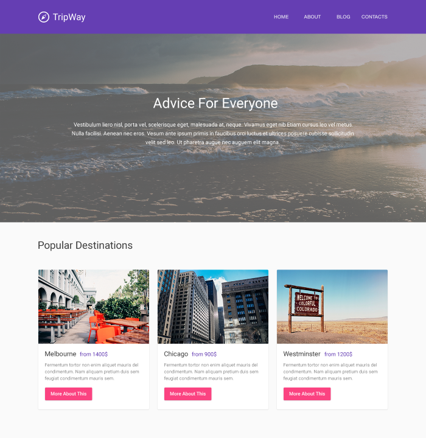
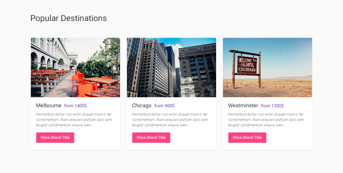

# iHeartMedia Quick Wins Team Front-end Developer Coding Test

### Introduction
Please read all of the instructions provided below as it contains all of the required resources to successfully complete this coding test. This exercise is given to measure your technical coding ability to complete similar Tasks and Assignments you will receive in your role as a front-end developer on the Quick Wins Team.

Thank you for taking the time to demonstrate your technical coding expertise!

### Assignment
Create a website that meets all of the following requirements and, as closely as possible, matches the provided design mock up:

Choose either the Plain HTML/CSS/JS or React path for the starting point of your assignment. Go with the option that allows you to produce the best quality site within the given assignment timeframe:
- [ ] For Plain HTML/CSS/JS (no JS frameworks):

  - Start with [Bootstrap Starter Template](https://getbootstrap.com/docs/4.0/examples/starter-template/)

- [ ] For React Applications:

  - Start with [create-react-app](https://github.com/facebook/create-react-app) and import Bootstrap CSS into your project (Libraries like "react-bootstrap" and "reactstrap" are not required)

- [ ] Build the site using the Bootstrap Grid System for Responsive implementation of the design mock up

  - The Responsive design will be tested using the Google Chrome DevTools Inspector "iPhone X" rendering preview for any QA you'd like to perform
  - The provided mock up only contains the design for Desktop and we're interested to see how you handle the Responsive implementation for mobile devices with the Bootstrap Grid System

#### For the Items within the Popular Desintations Grid:

- [ ] Use DRY (do not repeat yourself) principle and create a re-usable template for the Grid Items that share both HTML and/or JSX markup and a single CSS Class for Grid Item styling
- [ ] Use an external JSON file to load the required data to produce the Grid Items with the template you created in the step above

#### The completed project must be easily demonstrable by any of the following methods:
- [ ] Runs in the browser without additional setup
- [ ] Live URL may be provided
- [ ] Runs without errors in a local development environment via localhost

#### The deliverables must include:
- [ ] Github repository link for the assignment build
- [ ] One of the methods above to demonstrate the assignment website in the browser

## Resources
Design Mock Up
- [Static Preview](./home-page.png)
- Photoshop File for asset export
  - "home-page.psd" in the repo
  - After downloading the repo which will include the above Photoshop file, you can View and export PSD assets as well as inspect specific typography and styling with [Photopea](https://www.photopea.com/) if Adobe Photoshop is unavailable to you.

Bootstrap
- [Bootstrap Documentation](https://getbootstrap.com/docs/4.0/getting-started/introduction/)
- [Bootstrap Starter Template](https://getbootstrap.com/docs/4.0/examples/starter-template/)
- [Adding Bootstrap to Create React App](https://create-react-app.dev/docs/adding-bootstrap/)

React
- [create-react-app](https://github.com/facebook/create-react-app)
